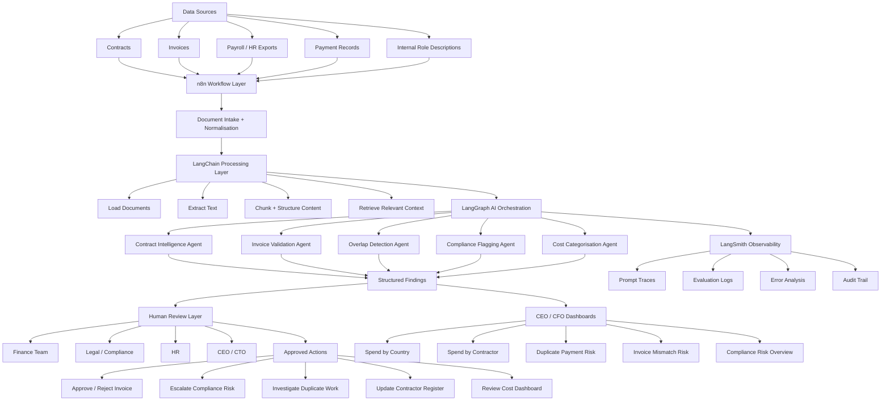

# SilverTrust — Project 4 | Tuesday Deliverables
## Solution Design | Compliance Package | LangSmith Monitoring
**ContractOS for Oracle Game Studio | Daria Bystrova & Julian Grandaos**

---

## Deliverable 4 — Solution Design

### 4.1 What ContractOS Does

ContractOS is a single AI-powered interface that reads every contractor and employee agreement at Oracle, extracts structured data, validates invoices, detects duplicate payments, checks compliance across five jurisdictions, and gives leadership a live view of where their money is going. It sits on top of Oracle's existing payment rails and does not replace them.

<!-- FIVE CAPABILITIES — each maps 1:1 to one of the five AI agents in sections 4.3 and 4.4.
     This alignment is intentional: one capability = one agent = one clear responsibility.
     Pain points come directly from the Monday discovery interview with Eugen and Thibaud. -->

| Capability | Agent that powers it | What the AI does | Pain point solved |
|---|---|---|---|
| **1. Contract Intelligence** | Contract Intelligence Agent | Reads all contracts across formats and languages. Extracts: person, role, rate, currency, contract type, jurisdiction, notice period, IP clauses, renewal date, GDPR clause presence. | Lost contractor visibility, no single contract view |
| **2. Invoice Validation** | Invoice Validation Agent | Validates every incoming invoice against the contract terms before payment is approved. Flags amount mismatches, currency errors, and scope discrepancies. | Wrong invoicing, payments not matching contracts |
| **3. Overlap Detection** | Overlap Detection Agent | Compares contractor scope descriptions against internal job roles using semantic similarity. Flags where the same work is being paid twice inside and outside the company. | Paying twice for same work, internal vs external overlap |
| **4. Compliance Flagging** | Compliance Flagging Agent | Checks each contract against jurisdiction-specific rule sets. Outputs Red / Amber / Green status with specific flags for misclassification risk, missing GDPR clauses, and ambiguous IP assignment. | Compliance unknown, misclassification risk across five countries |
| **5. Cost Categorisation** | Cost Categorisation Agent | Categorises all workforce spend by country, contract type, team, and intermediary. Real-time burn visibility in one view for Thibaud and Eugen. | No cost visibility, burn exceeding revenue, intermediary opacity |

---

### 4.2 The Workflow

<!-- WORKFLOW: Seven steps from document upload to payment confirmation.
     Steps 2-4 are AI-powered. Step 5 is human-only — this is the EU AI Act compliance gate.
     No AI output ever skips step 5 to reach step 6. -->

| # | Step | What happens | AI or software |
|---|---|---|---|
| 1 | **Ingest** | User uploads contracts and invoices (PDF, Word, scan) via the dashboard. n8n also watches connected folders and email inboxes automatically. Files stored in EU infrastructure. | Plain software — n8n |
| 2 | **Extract & validate** | Contract Intelligence Agent extracts structured fields. Invoice Validation Agent checks invoices against contract terms simultaneously. | AI — LLM |
| 3 | **Detect overlap** | Overlap Detection Agent compares contractor scope against internal job roles. Flags duplicate spend. | AI — LLM |
| 4 | **Compliance & cost** | Compliance Flagging Agent checks each contract against jurisdiction rules. Cost Categorisation Agent updates the burn dashboard. | AI — LLM + plain software |
| 5 | **Human review** | All flags from all five agents go to a human approval queue. No AI output triggers automated action. Thibaud approves payment holds. Legal reviews compliance flags. HR reviews overlap flags. | **Human only** |
| 6 | **Payment** | Approved payments routed via Wise API or local intermediary. Confirmation logged to audit trail. | Plain software |
| 7 | **Monitor** | Every LLM call across all five agents traced in LangSmith with inputs, outputs, confidence score, and latency logged. | LangSmith |

---

### 4.3 Five AI Agents Under the Hood

<!-- WHY FIVE AGENTS: Each agent is a specialist with a single responsibility.
     This makes the system easier to monitor (you know exactly which agent produced which output),
     easier to retrain (if Invoice Validation underperforms, only that agent is updated),
     and easier to classify under the EU AI Act (each agent's risk level can be assessed independently).
     All five are orchestrated by LangGraph — see section 4.4 for the full technical architecture. -->

> The five capabilities above are client-facing. Under the hood each is delivered by a dedicated AI agent, all orchestrated by LangGraph. Every agent produces structured outputs and confidence scores — none executes final decisions.

| Agent | Capability it powers | Technical description |
|---|---|---|
| **Agent 1 — Contract Intelligence Agent** | Contract Intelligence | LLM ingests contract documents. Structured extraction prompt returns JSON: name, role, rate, currency, jurisdiction, notice period, IP clause status, GDPR clause status, working arrangement description. Output stored in Contract Register DB. |
| **Agent 2 — Invoice Validation Agent** | Invoice Validation | LLM reads incoming invoice text and compares it against extracted contract terms. Flags discrepancies in amount, currency, scope, and billing period. Output: validated / flagged + specific mismatch detail. |
| **Agent 3 — Overlap Detection Agent** | Overlap Detection | LLM compares contractor working arrangement descriptions against internal job role descriptions using semantic similarity. Flags pairs where scope overlap exceeds threshold. Output: overlap alert with contractor name, internal role, estimated duplicate cost. |
| **Agent 4 — Compliance Flagging Agent** | Compliance Flagging | LLM checks extracted contract data against jurisdiction-specific rule sets: GDPR clause presence, IP assignment clarity, misclassification indicators (NL DBA, German Scheinselbstständigkeit, French rules), notice period minimums. Output: Red / Amber / Green status + specific flags per contract. |
| **Agent 5 — Cost Categorisation Agent** | Cost Categorisation | LLM normalises ambiguous spend descriptions and categorises all payments by country, contract type, team, and intermediary. Plain software aggregates and renders the dashboard. Output: categorised cost register + burn trend. |

<!-- CRITICAL NOTE: "none executes final decisions" is not just good practice — it is what keeps
     ContractOS at limited/minimal risk under the EU AI Act. If any agent triggered a payment,
     reclassification, or termination automatically, the system would become high-risk under
     Annex III point 4 and require a full conformity assessment. The human review layer in
     section 4.4 technically enforces this. -->

---

### 4.4 Technical Infrastructure Architecture

<!-- WHAT THIS SECTION IS: The technical "how it's built" explanation. It matters for two reasons:
     1. EU AI Act classification depends on proving human oversight is technically enforced, not just promised
     2. GDPR compliance depends on proving all data stays on EU infrastructure
     Read top to bottom: data comes in → n8n routes it → LangChain reads it →
     LangGraph sends it to the right agent → agents produce findings →
     humans review → actions taken + LangSmith logs everything -->

ContractOS is built as an EU-hosted, privacy-first AI intelligence layer using **n8n**, **LangChain**, **LangGraph**, and **LangSmith**.

<!-- TECH STACK TABLE: Four tools, each with a distinct role. Think of them as layers:
     - n8n = the front door (receives and routes all incoming documents)
     - LangChain = the filing clerk (reads, extracts, and prepares content for agents)
     - LangGraph = the manager (coordinates which agent does what and tracks state)
     - LangSmith = the auditor (records every AI action for monitoring and compliance) -->

| Layer | Technology | Role |
|---|---|---|
| **Workflow & integration** | n8n | Connects to all data sources: contract folders, email inboxes, invoice uploads, payroll exports, HR records, payment confirmations |
| **Document processing** | LangChain | Document loading, text extraction, chunking, retrieval, and structured information extraction from contracts, invoices, role descriptions, and payment records |
| **Agent orchestration** | LangGraph | Coordinates the five AI agents, manages state, routes structured outputs to human review |
| **Observability** | LangSmith | Monitors AI workflows, stores traces, supports evaluation, provides audit trail for errors, model behaviour, prompt versions, and decision paths |
| **Hosting** | EU-controlled environment | Role-based access, encrypted storage, minimal data retention, audit logs, human approval gates before any financial or employment action |

#### Architecture Diagram

<!-- HOW TO READ THIS DIAGRAM (top to bottom):
     1. TOP: All the messy data sources Oracle has today
     2. n8n: Receives and normalises everything
     3. LangChain: Loads, extracts, chunks, retrieves context
     4. LangGraph: Routes content to the correct agent
     5. FIVE AGENTS: Each runs, produces structured findings
     6. STRUCTURED FINDINGS flow to THREE places simultaneously:
        → Human Review Layer (left) — no action without a named human approving
        → LangSmith (right) — every step logged for audit and monitoring
        → CEO/CFO Dashboards (bottom) — aggregated view for leadership
     KEY POINT FOR ASSESSORS: there is NO direct line from agents to actions.
     Everything passes through the human review layer first. -->

#### Human Review Layer — Non-Negotiable

<!-- WHY THIS TABLE EXISTS: This is the EU AI Act compliance proof.
     ContractOS stays at limited/minimal risk (not high-risk) because no AI output
     triggers an automatic employment or financial decision.
     This table names exactly who reviews what — so if a regulator asks "who approved this?"
     there is always a named human role with documented responsibility.
     If Oracle ever removes this step, the system becomes high-risk under Annex III point 4
     and requires a full conformity assessment before it can legally operate. -->

All agent outputs route to a human approval queue before any action is taken.

| Reviewer | Actions they approve |
|---|---|
| **Finance Team** | Approve / reject invoice payments |
| **Legal / Compliance** | Escalate compliance risks, review misclassification flags |
| **HR** | Investigate duplicate work, update contractor register |
| **CEO / CTO (Eugen)** | Review cost dashboard, approve strategic decisions |
| **CFO (Thibaud)** | Approve payment holds, review cost reduction flags |

---

### 4.5 Where AI Is Genuinely Needed vs Plain Software

| AI / LLM reasoning genuinely needed | Plain software sufficient |
|---|---|
| Extracting data from unstructured, multilingual, inconsistent contract templates | Storing extracted data in a structured database |
| Semantic overlap detection between contractor scope and internal job roles | Cost dashboard, charts, aggregation |
| Misclassification risk — interpreting natural language working arrangements against legal rules | Payment routing via Wise API |
| Missing clause detection — jurisdiction-specific legal knowledge | Access control and role-based permissions |
| Invoice anomaly detection — normalising messy multilingual invoice formats | Audit trail and notification alerts |

---

### 4.6 Data the System Touches

**Inputs:**

| Data | Source | Format | Personal data? |
|---|---|---|---|
| Contractor / employee contracts | Uploaded by Oracle HR / Finance | PDF, Word, scanned | **YES — names, rates, bank details, tax IDs** |
| Invoices | Uploaded by Finance | PDF, Excel, email | **YES — names, amounts, payment details** |
| Internal job descriptions / payroll records | Exported from HR system | CSV, Excel | **YES — names, roles, salaries** |
| Jurisdiction rule sets | Built into system config | Internal config | NO |

**Storage and retention:**

| Data store | Location | Retention | Justification |
|---|---|---|---|
| Contract database | AWS Frankfurt (EU) | Engagement duration + local minimum | Legal obligation: Germany 10yr, India 8yr, NL 7yr |
| Invoice database | AWS Frankfurt (EU) | 10 years | German commercial law maximum |
| Payroll records | AWS Frankfurt (EU) | Per jurisdiction minimum | Legal obligation varies by country |
| LangSmith traces | EU region (configurable) | 90 days | Operational monitoring only — PII redacted before logging |
| Audit trail | AWS Frankfurt (EU) | 7 years minimum | Legal obligation + accountability |

> ⚠️ **Critical design constraint:** All data is processed on EU infrastructure. No personal data is sent to US-based LLM APIs without SCCs and a signed DPA. LangSmith traces must be configured to redact personal identifiers before logging.

---

## Deliverable 5 — Compliance-by-Design Package

### 5.1 EU AI Act — Risk Classification

| Field | Assessment |
|---|---|
| **Risk classification** | **MINIMAL RISK** (contract extraction, cost dashboard, payment tracking) / **LIMITED RISK** (overlap detection, misclassification flagging) |
| **Justification** | ContractOS does not make decisions that directly affect individuals. It surfaces information and flags anomalies for human review. No automated action is taken on any output. The misclassification flagging touches employment classification which edges toward Annex III point 4 territory — however because a human lawyer must review every flag before any action, it remains at limited risk. |
| **Why NOT high-risk** | Annex III point 4 (employment decisions) would apply if ContractOS outputs were used to automatically terminate, reclassify, or take adverse action against workers. The mandatory human review queue prevents this. If Oracle were to bypass the human review step, the system would become high-risk and the classification would need to change. |
| **SilverTrust role** | PROVIDER — SilverTrust designs, builds, and deploys ContractOS |
| **Oracle role** | DEPLOYER — Oracle uses ContractOS in their operations |

**Provider obligations (SilverTrust):**
- Maintain technical documentation of the system
- Implement quality management and logging
- Register in EU database if system becomes high-risk
- Ensure human oversight is technically enforced, not just policy

**Deployer obligations (Oracle):**
- Use ContractOS only within its intended purpose
- Maintain human review for all flags before action
- Inform affected workers that AI is used in contract analysis (transparency obligation)
- Conduct own data protection impact assessment for the deployment

---

### 5.2 GDPR — Data Map and Lawful Basis

| Personal data use | Lawful basis | Article | Notes and constraints |
|---|---|---|---|
| Processing employment contracts containing names, rates, bank details | Contract performance | Art. 6(1)(b) | Processing is necessary to manage the employment/contractor relationship. No separate consent needed. |
| Processing payroll records and invoices | Legal obligation | Art. 6(1)(c) | Tax law, labour law, and accounting obligations in each jurisdiction require retention of payroll records. |
| Sending contracts to LLM for extraction | **Legitimate interest** | Art. 6(1)(f) | Oracle's interest in cost control and compliance. LIA required before go-live — see section 5.2a below. |
| Overlap detection — comparing contractor and employee role descriptions | **Legitimate interest** | Art. 6(1)(f) | Oracle's interest in preventing duplicate spend. LIA required — see section 5.2a below. |
| Compliance checking — checking worker classification | Legal obligation | Art. 6(1)(c) | Employer has legal obligation to correctly classify workers. Compliance checking serves this obligation. |
| LangSmith monitoring traces | **Legitimate interest** | Art. 6(1)(f) | Operational monitoring of AI system. PII redacted before logging. 90-day retention maximum. LIA required — see section 5.2a below. |

---

### 5.2a Legitimate Interest Assessment (LIA)

> Under GDPR Art. 6(1)(f), legitimate interest as a lawful basis requires passing a three-step test: (1) the interest must be legitimate, (2) the processing must be necessary to achieve it, and (3) the interest must not be overridden by the data subject's rights and freedoms. This section documents that test for the three uses of LI above.

#### LIA 1 — Sending contracts to LLM for extraction

| Step | Assessment |
|---|---|
| **1. Legitimate interest** | Oracle has a genuine commercial and legal interest in understanding the terms of its own workforce contracts — to control costs, prevent overpayment, and meet employer obligations. This is a recognised business interest. |
| **2. Necessity** | Manual review of 900+ contracts across five languages and jurisdictions is not feasible within Oracle's current capacity. LLM extraction is the only proportionate method to achieve visibility at scale. A less privacy-invasive alternative (manual review) exists in principle but is not operationally realistic. |
| **3. Balancing test** | Workers have a privacy interest in their contract terms, but this data is already held by Oracle under a legitimate contractual relationship. The LLM extracts only structured fields (rate, jurisdiction, notice period) — not free text. No content is shared with third parties beyond the LLM provider under DPA. Impact on workers is low. Oracle's interest prevails. |
| **Safeguards** | DPA with LLM provider required. EU-based processing only. Extracted fields only — no free-text storage. Workers informed via transparency notice before go-live. |
| **Conclusion** | **LI basis is defensible** — provided safeguards are in place before go-live. |

#### LIA 2 — Overlap detection (comparing contractor and employee role descriptions)

| Step | Assessment |
|---|---|
| **1. Legitimate interest** | Oracle has a genuine financial interest in identifying where it is paying twice for the same work. Preventing wasteful spend and ensuring efficient use of company resources is a recognised legitimate interest. |
| **2. Necessity** | Overlap cannot be detected without comparing contractor scope descriptions against internal job roles. This requires processing personal employment data. No less intrusive method achieves the same result. |
| **3. Balancing test** | Workers may not expect their role descriptions to be compared against contractors' scope, but the processing does not reveal sensitive personal information — it compares job function descriptions, not health, beliefs, or private life data. The output is a business flag reviewed by a human, not a decision taken against the individual. Impact on workers is low to medium. Oracle's financial interest prevails, provided the output triggers human review only. |
| **Safeguards** | Human review mandatory before any action. Overlap flag does not name the worker to external parties. Transparency notice required. Results retained only as long as operationally necessary. |
| **Conclusion** | **LI basis is defensible** — provided human review is maintained and workers are informed. |

#### LIA 3 — LangSmith monitoring traces

| Step | Assessment |
|---|---|
| **1. Legitimate interest** | SilverTrust (as provider) and Oracle (as deployer) have a legitimate interest in monitoring the AI system's behaviour for accuracy, safety, and auditability — including demonstrating compliance with the EU AI Act. |
| **2. Necessity** | Monitoring requires logging inputs and outputs of LLM calls. Some inputs may contain personal data fragments from contracts despite extraction being the intended use. Logging cannot achieve its safety purpose without capturing what the model processed. |
| **3. Balancing test** | Workers have no reasonable expectation that operational AI logs would not exist. The impact is minimal because: PII is redacted before storage, traces are retained for only 90 days, access is restricted to SilverTrust engineers and Oracle's compliance team, and traces are never used for purposes beyond system monitoring. |
| **Safeguards** | PII redaction configured as a technical control, not a policy promise. 90-day auto-deletion. Access controls enforced. Traces never used for HR decisions. |
| **Conclusion** | **LI basis is defensible** — redaction and retention controls are non-negotiable preconditions. |

---

### 5.2b What Oracle Must Do Before Go-Live

> These are not optional — they are the conditions that make the LI basis legally defensible.

- [ ] Complete and document all three LIAs above in writing
- [ ] Sign a Data Processing Agreement (DPA) with the LLM provider (Anthropic / OpenAI / equivalent)
- [ ] Confirm LLM provider processes data in EU region only — or execute Standard Contractual Clauses (SCCs)
- [ ] Publish a transparency notice to all workers before ContractOS processes their contract data
- [ ] Configure PII redaction in LangSmith before first production trace is created
- [ ] Set 90-day auto-deletion on LangSmith traces
- [ ] Consult German works council before go-live (BetrVG — separate obligation, see section 5.4)

---

### 5.3 GDPR — Data Minimisation and Subject Rights

**Data minimisation choices:**
- LLM extracts only the fields needed for each use case — no free-text contract content is stored, only structured extracted fields
- LangSmith traces are configured to redact names, rates, and bank details before logging
- Cost dashboard aggregates data — Eugen sees totals by country/type, not individual worker data
- Role-based access: Thibaud sees flags and aggregates; only authorised HR sees individual contract data

**Data subject rights handling:**

| Right | How ContractOS handles it |
|---|---|
| Access (Art. 15) | Worker can request all data held. System must be able to export all extracted fields linked to a named individual within 30 days. |
| Erasure (Art. 17) | Erasure applies after retention period expires. During retention period, legal obligation basis overrides erasure request for payroll records. Extracted fields not required for legal retention can be deleted on request. |
| Rectification (Art. 16) | If extraction was incorrect, worker can request correction of extracted fields. Source document takes precedence. |
| Object to processing (Art. 21) | Where legitimate interest is the basis (LLM processing, monitoring), workers can object. Oracle must assess and respond within 30 days. |
| Automated decisions (Art. 22) | ContractOS does not make automated decisions with legal effect — human review is mandatory. Art. 22 does not apply as long as human review queue is maintained. |

---

### 5.4 Other Applicable Law

| Law | How it applies | Our response |
|---|---|---|
| **NL DBA Act (2025)** | Requires genuine independence for contractors. Platform flags contractors whose working arrangement description looks like employment. | Agent 4 flags. Human + legal review required before any action. |
| **German BetrVG** | Works council must be consulted before deploying AI systems that process employee data. Applies to Oracle's German staff. | Oracle must consult works council before go-live. SilverTrust provides technical documentation to support this. |
| **India DPDP Act 2023** | India's data protection law applies to processing of Indian workers' personal data. | Data stays EU-side. Indian contractor data processed under contract performance basis. Local counsel review recommended. |
| **Philippines DPA 2012** | Similar to GDPR. Requires lawful basis for processing. NPC registration may be needed. | Lawful basis documented. Oracle to obtain local counsel advice on NPC registration. |
| **Russia — sanctions + data localisation** | Russian data localisation law requires personal data of Russian citizens to be stored in Russia. Current sanctions environment creates payment complexity. | Specialist legal advice required before processing Russian worker data. Out of scope for ContractOS v1. |
| **IP assignment law** | Contractor-created IP must be explicitly assigned. Agent 1 flags ambiguous or absent IP clauses. | Flag only. Legal review required before relying on assignment. |

---

### 5.5 Compliance Memo — Plain Language for Oracle

**To:** Eugen and Thibaud, Oracle Game Studio
**From:** SilverTrust
**Re:** Is ContractOS legally safe to use?

The short answer is yes — with three conditions you must respect.

First, ContractOS reads your contracts and flags problems. It does not make decisions. Every flag goes to a human — Thibaud, your HR team, or your lawyers — before anything happens. As long as that stays true, the system sits in the lowest risk category under the new EU AI Act.

Second, your engineers and contractors have data rights. They can ask what data you hold about them, request corrections, and in some cases ask for deletion. ContractOS is built so you can answer those requests within the legally required 30 days. We recommend you tell your workforce that AI is being used to analyse contracts — you are legally required to be transparent about this.

Third, if you have German staff, your works council needs to be consulted before you go live. This is German law — not optional. We will provide the technical documentation they need. For Russian contractors, you will need separate legal advice before we can process their data — this is a complex area we are keeping out of scope for now.

> *The main ongoing obligation is simple: never let the system act on a flag without a human reviewing it first. If that review step is ever removed, the legal position changes significantly.*

---

## Deliverable 6 — LangSmith Monitoring

### 6.1 LangSmith Project Setup

- **Project name:** `contractos-oracle-prod`
- All five agents traced: `contract-intelligence`, `invoice-validation`, `overlap-detection`, `compliance-flagging`, `cost-categorisation`
- Every LLM call logged: input prompt, output, model used, latency, token count
- PII redaction configured: names, rates, bank details stripped from traces before storage
- EU region selected for trace storage
- Feedback tags enabled: `human-approved`, `human-rejected`, `override`

---

### 6.2 What We Monitor and Why

| What we monitor | Why | Alert threshold |
|---|---|---|
| Extraction confidence score per field | Low confidence = field may be wrong. Catches ambiguous contract language before it reaches the register. | Flag for human review if confidence < 0.80 on rate, jurisdiction, or IP clause fields |
| Human override rate | If humans are overriding AI flags frequently, the model is miscalibrated. High override = signal to retrain or adjust prompts. | Alert if override rate > 20% in any 7-day window |
| Latency per agent call | Slow extraction blocks the workflow. Latency spikes may indicate model issues or document complexity. | Alert if p95 latency > 30 seconds |
| Failed extractions | Scanned or corrupted documents may fail. Failures must be flagged for manual processing. | Alert on any extraction failure — zero tolerance |
| Compliance flag distribution | Track Red / Amber / Green trends. Sudden spike in Red flags may indicate systematic contract problem. | Alert if Red flags > 10% of new contracts in a week |
| PII redaction verification | Confirm that names and sensitive fields are not appearing in trace logs. Critical for GDPR compliance. | Automated redaction audit weekly — zero tolerance for PII in traces |

---

### 6.3 Plain-Language Explanation for Oracle

> *"Here is where you can see everything the AI did, catch a mistake before it costs you money, and prove to an auditor exactly what happened and when."*

Every time ContractOS reads a contract, we log exactly what it extracted and how confident it was. If it said a contractor is paid €3,000 per month but was only 70% confident, you will see that flag before the invoice is approved. If a human reviewer corrects an AI output, that correction is logged too. Nothing is hidden.

If a regulator, a works council, or an auditor ever asks what happened with a specific contractor's data — when it was processed, what was extracted, who reviewed it, what decision was made — you can show them the complete chain in under five minutes. That is what LangSmith gives you. Not a promise of transparency. Actual transparency.

We also watch for warning signs automatically. If the AI starts making more mistakes than usual — if humans are frequently overriding its outputs — we get an alert and we fix it before it becomes a problem for you. You will never be in a situation where the system has been quietly wrong for weeks without anyone noticing.

✅ **LangSmith project:** `contractos-oracle-prod`
🔗 **Live link:** https://eu.smith.langchain.com/o/453c43c0-ddb5-408a-a509-630402964189/projects/p/bff005c1-351b-4293-92ca-623f47b8ba5b
📸 **Screenshots:** [`/langsmith/screenshots/`](./langsmith/screenshots/)

### 6.4 LangSmith Screenshots & Agent Execution Observations

All six runs completed successfully in project `contractos-oracle-prod` on the EU endpoint (`eu.api.smith.langchain.com`). Below are the screenshots and observations from each agent execution.

---

**Screenshot 1 — Project overview: all 6 runs**

**Observations:**
- All 5 agents ran successfully (6 runs total — Agent 2 ran twice: one valid invoice, one mismatch)
- `compliance-flagging-agent` had the highest latency at **10.02s** — expected given the complexity of multi-jurisdiction legal analysis
- `cost-categorisation-agent` was fastest at **2.44s** — simpler categorisation task
- All runs show green status except one earlier `contract-intelligence-agent` run that failed with model-not-found (wrong model name — fixed before final run)
- Cost per run ranged from **$0.0023 to $0.0068** — well within acceptable operational cost

---

**Screenshot 2 — Agent 1: Contract Intelligence Agent — Jana Novak**

**Observations:**
- Input: Jana Novak's freelance agreement (Czech Republic, EUR 600/day, 6 months renewable)
- Output extracted correctly: name, role, rate, currency, jurisdiction, notice period 14 days, IP clause present, GDPR clause **absent** — correctly flagged
- Working arrangement description captured: *"Freelance backend engineer working exclusively for Oracle following internal development processes with Oracle-provided equipment"* — this description fed directly into Agent 3 for overlap detection
- Latency: **3.70s** — reasonable for unstructured contract reading
- Token count: **416** — efficient prompt

---

**Screenshot 3 — Agent 4: Compliance Flagging Agent — Arjun Sharma RED**

**Observations:**
- Input: Arjun Sharma's contract, jurisdiction Netherlands / India
- Output: **status: RED** — highest risk classification
- Flags identified by the agent:
  - Fixed 40-hour work week → employment indicator under NL DBA Act
  - Integration into daily standups and Oracle Slack → organisational integration = employment indicator
  - Oracle-provided equipment and infrastructure → removes genuine contractor independence
  - Missing GDPR data processing clause
  - Missing IP assignment clause
- `requires_legal_review: true` — correctly routed to human queue
- Latency: **10.02s** — longest run, reflecting multi-jurisdiction compliance reasoning
- Token count: **735** — highest token use, as expected for complex legal analysis

---

**Screenshot 4 — Agent 3: Overlap Detection Agent — Jana Novak vs Internal Engineer**

**Observations:**
- Input: Jana's contractor scope vs Senior Backend Engineer internal role description
- Output: `overlap_detected: true`, `overlap_score: 95/100`
- Agent reasoning: *"The contractor and internal employee have nearly identical responsibilities in backend API development, database optimization, code review, and payment provider integration for the same payment systems domain"*
- `estimated_monthly_duplicate_cost_eur: 8500`
- `recommended_action: escalate immediately`
- `confidence: 98` — very high confidence, strong semantic overlap
- Latency: **2.85s** — fast semantic comparison

---

**Screenshot 5 — Agent 2: Invoice Validation Agent — Raj Consulting MISMATCH**

**Observations:**
- Input: Invoice #311 from Raj Consulting Ltd, Mumbai — 22 days QA testing, USD 9,900 — claiming "rate adjustment per verbal agreement"
- Contract rate: USD 400/day
- Output: `status: flagged`, `mismatch_detected: true`
- Agent reasoning: Invoice amount USD 9,900 exceeds expected USD 8,800 (22 days × $400). Vendor claims verbal rate adjustment — not documented in contract
- `recommended_action: hold for review`
- `confidence: 95` — correctly uncertain due to claimed verbal agreement
- This is exactly the type of error Oracle is currently paying through without detection

---

**Screenshot 6 — Agent 5: Cost Categorisation Agent — TechStaff Philippines**

**Observations:**
- Input: PHP 480,000 monthly retainer to TechStaff Philippines Inc for 3 frontend developers
- Output: `country: Philippines`, `contract_type: intermediary`, `team: frontend`, `via_intermediary: true`, `intermediary_name: TechStaff Philippines Inc`, `amount_eur: 8200`, `currency_original: PHP`, `category: engineering`
- `confidence: 95` — correctly identified intermediary structure and converted currency
- This is exactly the type of payment Oracle has lost track of — an intermediary routing payment to multiple developers with no individual contract visibility
- Latency: **2.44s** — fastest agent

---

### Summary of Agent Execution Results

| Agent | Run result | Key finding | Action required |
|---|---|---|---|
| Contract Intelligence | ✅ Clean | Jana Novak: GDPR clause absent, IP clause present | Flag GDPR gap |
| Invoice Validation (Jana) | ✅ Valid | EUR 12,600 for 18 days at EUR 600/day — technically valid | Approve |
| Invoice Validation (Raj) | ⚠️ Flagged | USD 9,900 vs expected USD 8,800 — verbal rate claim undocumented | Hold for review |
| Overlap Detection | 🔴 Escalate | Jana vs internal engineer — 95/100 overlap, €8,500/month duplicate | Escalate immediately |
| Compliance Flagging | 🔴 Red | Arjun Sharma — misclassification risk, missing GDPR + IP clauses | Legal review required |
| Cost Categorisation | ✅ Categorised | TechStaff Philippines — intermediary, EUR 8,200/month, engineering | Dashboard updated |

---

*Daria Bystrova & Julian Granados — SilverTrust Project 4 — Tuesday Deliverables 4, 5, 6*
