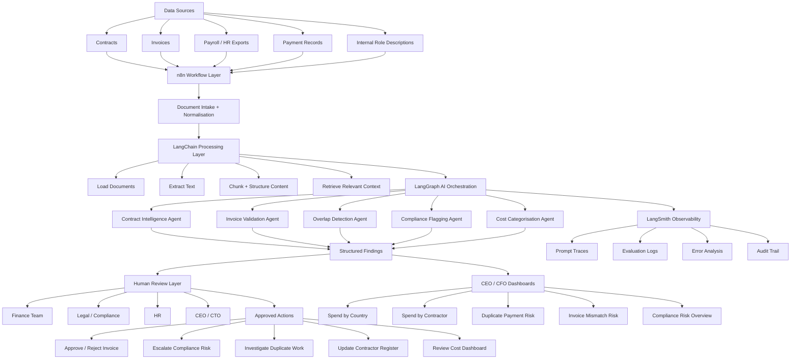

# SilverTrust — Project 4 | Tuesday Deliverables
## Solution Design | Compliance Package | LangSmith Monitoring
**ContractOS for Oracle Game Studio | Daria Bystrova & Julian Grandaos**

---

## Deliverable 4 — Solution Design

### 4.1 What ContractOS Does

ContractOS is a single AI-powered interface that reads every contractor and employee agreement at Oracle, extracts structured data, detects duplicate and overlapping payments, validates invoices against contract terms, and gives leadership a live view of where their money is going. It sits on top of Oracle's existing payment rails and does not replace them.

| Capability | What the AI does | Pain point solved |
|---|---|---|
| **1. Contract Intelligence** | Reads all contracts across formats and languages. Extracts: person, role, rate, currency, contract type, jurisdiction, notice period, IP clauses, renewal date, GDPR clause presence. | Lost contractor visibility, no single contract view, compliance unknown |
| **2. Overlap Detection** | Compares contractor scope descriptions against internal job roles using semantic similarity. Flags where same work is being paid twice inside and outside the company. | Paying twice for same work, internal vs external overlap |
| **3. Cost Dashboard** | Categorises all workforce spend by country, contract type, team, and intermediary. Real-time burn visibility in one view for Thibaud and Eugen. | No cost visibility, burn exceeding revenue |
| **4. Payment Tracking** | Validates incoming invoices against contract terms. Flags mismatches. Confirms payment sent and arrived. Works alongside existing rails such as Wise. | Wrong invoicing, multi-country payroll bottleneck |

---

### 4.2 The Workflow

| # | Step | What happens | AI or software |
|---|---|---|---|
| 1 | **Ingest** | User uploads contracts and invoices (PDF, Word, scan) via the dashboard. Files are stored in EU-based infrastructure. | Plain software |
| 2 | **Extract** | Agent 1 (Contract Reader) reads each document and extracts structured fields into the Contract Register database. | AI — LLM |
| 3 | **Analyse** | Agent 2 (Cost Analyst) aggregates extracted data, categorises spend, flags invoice mismatches and contractor overlap. | AI + software |
| 4 | **Compliance check** | Agent 3 (Compliance Checker) checks each contract against jurisdiction rules. Outputs Red / Amber / Green per contract. | AI — LLM |
| 5 | **Human review** | All flags go to a human approval queue. No AI output triggers automated action. Thibaud approves payment holds. Legal reviews reclassification flags. | **Human only** |
| 6 | **Payment** | Approved payments routed via Wise API or local intermediary. Confirmation logged to audit trail. | Plain software |
| 7 | **Monitor** | Every LLM call traced in LangSmith with inputs, outputs, confidence score, and latency logged. | LangSmith |

---

### 4.3 Three AI Agents Under the Hood

> The four capabilities are client-facing. Under the hood they are delivered by three AI agents. This is important for the solution design and the EU AI Act classification.

| Agent | Capabilities powered | Technical description |
|---|---|---|
| **Agent 1 — Contract Reader** | Contract Intelligence | LLM ingests contract documents. Structured extraction prompt returns JSON: name, role, rate, currency, jurisdiction, notice period, IP clause status, GDPR clause status, working arrangement description. Output stored in Contract Register DB. |
| **Agent 2 — Cost Analyst** | Overlap Detection, Cost Dashboard, Payment Tracking | LLM compares contractor working arrangement descriptions against internal job role descriptions using semantic similarity. Plain software handles cost aggregation and dashboard generation. LLM also normalises ambiguous invoice line items. |
| **Agent 3 — Compliance Checker** | Embedded across all four capabilities | LLM checks extracted contract data against jurisdiction-specific rule sets for: GDPR clause presence, IP assignment clarity, misclassification indicators (NL DBA, German rules, French rules), notice period compliance. Outputs status + specific flags per contract. |

---

### 4.4 Technical Infrastructure Architecture

ContractOS is built as an EU-hosted, privacy-first AI intelligence layer using **n8n**, **LangChain**, **LangGraph**, and **LangSmith**.

| Layer | Technology | Role |
|---|---|---|
| **Workflow & integration** | n8n | Connects to all data sources: contract folders, email inboxes, invoice uploads, payroll exports, HR records, payment confirmations |
| **Document processing** | LangChain | Document loading, text extraction, chunking, retrieval, and structured information extraction from contracts, invoices, role descriptions, and payment records |
| **Agent orchestration** | LangGraph | Coordinates the five AI agents, manages state, routes structured outputs to human review |
| **Observability** | LangSmith | Monitors AI workflows, stores traces, supports evaluation, provides audit trail for errors, model behaviour, prompt versions, and decision paths |
| **Hosting** | EU-controlled environment | Role-based access, encrypted storage, minimal data retention, audit logs, human approval gates |

#### Five AI Agents (LangGraph orchestrated)

| Agent | What it does |
|---|---|
| **Contract Intelligence Agent** | Extracts structured data from contracts across formats and languages |
| **Invoice Validation Agent** | Validates invoices against contract terms, flags mismatches before payment |
| **Overlap Detection Agent** | Detects where contractor scope duplicates internal employee roles |
| **Compliance Flagging Agent** | Checks contracts against jurisdiction-specific rule sets, outputs Red / Amber / Green |
| **Cost Categorisation Agent** | Categorises spend by country, type, team, and intermediary |

> Each agent produces structured outputs, confidence scores, and explanations — but does not execute final decisions.

#### Architecture Diagram

#### Human Review Layer — Non-Negotiable

All agent outputs route to a human approval queue before any action is taken.

| Reviewer | Actions they approve |
|---|---|
| **Finance Team** | Approve / reject invoice payments |
| **Legal / Compliance** | Escalate compliance risks, review misclassification flags |
| **HR** | Investigate duplicate work, update contractor register |
| **CEO / CTO (Eugen)** | Review cost dashboard, approve strategic decisions |
| **CFO (Thibaud)** | Approve payment holds, review cost reduction flags |

---

### 4.5 Where AI Is Genuinely Needed vs Plain Software

| AI / LLM reasoning genuinely needed | Plain software sufficient |
|---|---|
| Extracting data from unstructured, multilingual, inconsistent contract templates | Storing extracted data in a structured database |
| Semantic overlap detection between contractor scope and internal job roles | Cost dashboard, charts, aggregation |
| Misclassification risk — interpreting natural language working arrangements against legal rules | Payment routing via Wise API |
| Missing clause detection — jurisdiction-specific legal knowledge | Access control and role-based permissions |
| Invoice anomaly detection — normalising messy multilingual invoice formats | Audit trail and notification alerts |

---

### 4.6 Data the System Touches

**Inputs:**

| Data | Source | Format | Personal data? |
|---|---|---|---|
| Contractor / employee contracts | Uploaded by Oracle HR / Finance | PDF, Word, scanned | **YES — names, rates, bank details, tax IDs** |
| Invoices | Uploaded by Finance | PDF, Excel, email | **YES — names, amounts, payment details** |
| Internal job descriptions / payroll records | Exported from HR system | CSV, Excel | **YES — names, roles, salaries** |
| Jurisdiction rule sets | Built into system config | Internal config | NO |

**Storage and retention:**

| Data store | Location | Retention | Justification |
|---|---|---|---|
| Contract database | AWS Frankfurt (EU) | Engagement duration + local minimum | Legal obligation: Germany 10yr, India 8yr, NL 7yr |
| Invoice database | AWS Frankfurt (EU) | 10 years | German commercial law maximum |
| Payroll records | AWS Frankfurt (EU) | Per jurisdiction minimum | Legal obligation varies by country |
| LangSmith traces | EU region (configurable) | 90 days | Operational monitoring only — PII redacted before logging |
| Audit trail | AWS Frankfurt (EU) | 7 years minimum | Legal obligation + accountability |

> ⚠️ **Critical design constraint:** All data is processed on EU infrastructure. No personal data is sent to US-based LLM APIs without SCCs and a signed DPA. LangSmith traces must be configured to redact personal identifiers before logging.

---

## Deliverable 5 — Compliance-by-Design Package

### 5.1 EU AI Act — Risk Classification

| Field | Assessment |
|---|---|
| **Risk classification** | **MINIMAL RISK** (contract extraction, cost dashboard, payment tracking) / **LIMITED RISK** (overlap detection, misclassification flagging) |
| **Justification** | ContractOS does not make decisions that directly affect individuals. It surfaces information and flags anomalies for human review. No automated action is taken on any output. The misclassification flagging touches employment classification which edges toward Annex III point 4 territory — however because a human lawyer must review every flag before any action, it remains at limited risk. |
| **Why NOT high-risk** | Annex III point 4 (employment decisions) would apply if ContractOS outputs were used to automatically terminate, reclassify, or take adverse action against workers. The mandatory human review queue prevents this. If Oracle were to bypass the human review step, the system would become high-risk and the classification would need to change. |
| **SilverTrust role** | PROVIDER — SilverTrust designs, builds, and deploys ContractOS |
| **Oracle role** | DEPLOYER — Oracle uses ContractOS in their operations |

**Provider obligations (SilverTrust):**
- Maintain technical documentation of the system
- Implement quality management and logging
- Register in EU database if system becomes high-risk
- Ensure human oversight is technically enforced, not just policy

**Deployer obligations (Oracle):**
- Use ContractOS only within its intended purpose
- Maintain human review for all flags before action
- Inform affected workers that AI is used in contract analysis (transparency obligation)
- Conduct own data protection impact assessment for the deployment

---

### 5.2 GDPR — Data Map and Lawful Basis

| Personal data use | Lawful basis | Article | Notes and constraints |
|---|---|---|---|
| Processing employment contracts containing names, rates, bank details | Contract performance | Art. 6(1)(b) | Processing is necessary to manage the employment/contractor relationship. No separate consent needed. |
| Processing payroll records and invoices | Legal obligation | Art. 6(1)(c) | Tax law, labour law, and accounting obligations in each jurisdiction require retention of payroll records. |
| Sending contracts to LLM for extraction | Legitimate interest | Art. 6(1)(f) | **REQUIRES a Legitimate Interest Assessment (LIA).** Interest: cost control and compliance. Must be balanced against worker privacy. LIA must be documented before go-live. |
| Compliance checking — checking worker classification | Legal obligation | Art. 6(1)(c) | Employer has legal obligation to correctly classify workers. Compliance checking serves this obligation. |
| LangSmith monitoring traces | Legitimate interest | Art. 6(1)(f) | Operational monitoring of AI system. PII must be redacted from traces. 90-day retention maximum. |

---

### 5.3 GDPR — Data Minimisation and Subject Rights

**Data minimisation choices:**
- LLM extracts only the fields needed for each use case — no free-text contract content is stored, only structured extracted fields
- LangSmith traces are configured to redact names, rates, and bank details before logging
- Cost dashboard aggregates data — Eugen sees totals by country/type, not individual worker data
- Role-based access: Thibaud sees flags and aggregates; only authorised HR sees individual contract data

**Data subject rights handling:**

| Right | How ContractOS handles it |
|---|---|
| Access (Art. 15) | Worker can request all data held. System must be able to export all extracted fields linked to a named individual within 30 days. |
| Erasure (Art. 17) | Erasure applies after retention period expires. During retention period, legal obligation basis overrides erasure request for payroll records. Extracted fields not required for legal retention can be deleted on request. |
| Rectification (Art. 16) | If extraction was incorrect, worker can request correction of extracted fields. Source document takes precedence. |
| Object to processing (Art. 21) | Where legitimate interest is the basis (LLM processing, monitoring), workers can object. Oracle must assess and respond within 30 days. |
| Automated decisions (Art. 22) | ContractOS does not make automated decisions with legal effect — human review is mandatory. Art. 22 does not apply as long as human review queue is maintained. |

---

### 5.4 Other Applicable Law

| Law | How it applies | Our response |
|---|---|---|
| **NL DBA Act (2025)** | Requires genuine independence for contractors. Platform flags contractors whose working arrangement description looks like employment. | Agent 3 flags. Human + legal review required before any action. |
| **German BetrVG** | Works council must be consulted before deploying AI systems that process employee data. Applies to Oracle's German staff. | Oracle must consult works council before go-live. SilverTrust provides technical documentation to support this. |
| **India DPDP Act 2023** | India's data protection law applies to processing of Indian workers' personal data. | Data stays EU-side. Indian contractor data processed under contract performance basis. Local counsel review recommended. |
| **Philippines DPA 2012** | Similar to GDPR. Requires lawful basis for processing. NPC registration may be needed. | Lawful basis documented. Oracle to obtain local counsel advice on NPC registration. |
| **Russia — sanctions + data localisation** | Russian data localisation law requires personal data of Russian citizens to be stored in Russia. Current sanctions environment creates payment complexity. | Specialist legal advice required before processing Russian worker data. Out of scope for ContractOS v1. |
| **IP assignment law** | Contractor-created IP must be explicitly assigned. Agent 1 flags ambiguous or absent IP clauses. | Flag only. Legal review required before relying on assignment. |

---

### 5.5 Compliance Memo — Plain Language for Oracle

**To:** Eugen and Thibaud, Oracle Game Studio
**From:** SilverTrust
**Re:** Is ContractOS legally safe to use?

The short answer is yes — with three conditions you must respect.

First, ContractOS reads your contracts and flags problems. It does not make decisions. Every flag goes to a human — Thibaud, your HR team, or your lawyers — before anything happens. As long as that stays true, the system sits in the lowest risk category under the new EU AI Act.

Second, your engineers and contractors have data rights. They can ask what data you hold about them, request corrections, and in some cases ask for deletion. ContractOS is built so you can answer those requests within the legally required 30 days. We recommend you tell your workforce that AI is being used to analyse contracts — you are legally required to be transparent about this.

Third, if you have German staff, your works council needs to be consulted before you go live. This is German law — not optional. We will provide the technical documentation they need. For Russian contractors, you will need separate legal advice before we can process their data — this is a complex area we are keeping out of scope for now.

> *The main ongoing obligation is simple: never let the system act on a flag without a human reviewing it first. If that review step is ever removed, the legal position changes significantly.*

---

## Deliverable 6 — LangSmith Monitoring

### 6.1 LangSmith Project Setup

- **Project name:** `contractos-oracle-prod`
- All five agents traced: `contract-intelligence`, `invoice-validation`, `overlap-detection`, `compliance-flagging`, `cost-categorisation`
- Every LLM call logged: input prompt, output, model used, latency, token count
- PII redaction configured: names, rates, bank details stripped from traces before storage
- EU region selected for trace storage
- Feedback tags enabled: `human-approved`, `human-rejected`, `override`

---

### 6.2 What We Monitor and Why

| What we monitor | Why | Alert threshold |
|---|---|---|
| Extraction confidence score per field | Low confidence = field may be wrong. Catches ambiguous contract language before it reaches the register. | Flag for human review if confidence < 0.80 on rate, jurisdiction, or IP clause fields |
| Human override rate | If humans are overriding AI flags frequently, the model is miscalibrated. High override = signal to retrain or adjust prompts. | Alert if override rate > 20% in any 7-day window |
| Latency per agent call | Slow extraction blocks the workflow. Latency spikes may indicate model issues or document complexity. | Alert if p95 latency > 30 seconds |
| Failed extractions | Scanned or corrupted documents may fail. Failures must be flagged for manual processing. | Alert on any extraction failure — zero tolerance |
| Compliance flag distribution | Track Red / Amber / Green trends. Sudden spike in Red flags may indicate systematic contract problem. | Alert if Red flags > 10% of new contracts in a week |
| PII redaction verification | Confirm that names and sensitive fields are not appearing in trace logs. Critical for GDPR compliance. | Automated redaction audit weekly — zero tolerance for PII in traces |

---

### 6.3 Plain-Language Explanation for Oracle

> *"Here is where you can see everything the AI did, catch a mistake before it costs you money, and prove to an auditor exactly what happened and when."*

Every time ContractOS reads a contract, we log exactly what it extracted and how confident it was. If it said a contractor is paid €3,000 per month but was only 70% confident, you will see that flag before the invoice is approved. If a human reviewer corrects an AI output, that correction is logged too. Nothing is hidden.

If a regulator, a works council, or an auditor ever asks what happened with a specific contractor's data — when it was processed, what was extracted, who reviewed it, what decision was made — you can show them the complete chain in under five minutes. That is what LangSmith gives you. Not a promise of transparency. Actual transparency.

We also watch for warning signs automatically. If the AI starts making more mistakes than usual — if humans are frequently overriding its outputs — we get an alert and we fix it before it becomes a problem for you. You will never be in a situation where the system has been quietly wrong for weeks without anyone noticing.

✅ **LangSmith project:** `contractos-oracle-prod` — link and screenshots to be added to this repository

---

*Daria Bystrova & Julian Grandaos — SilverTrust Project 4 — Tuesday Deliverables 4, 5, 6*
