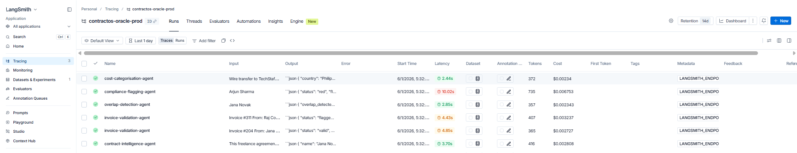
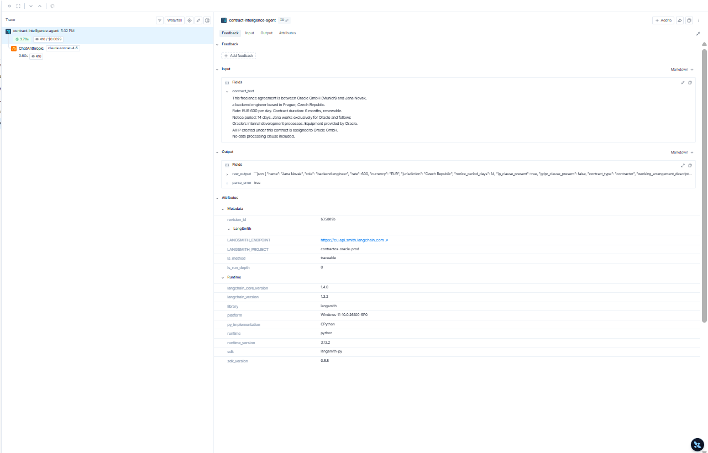
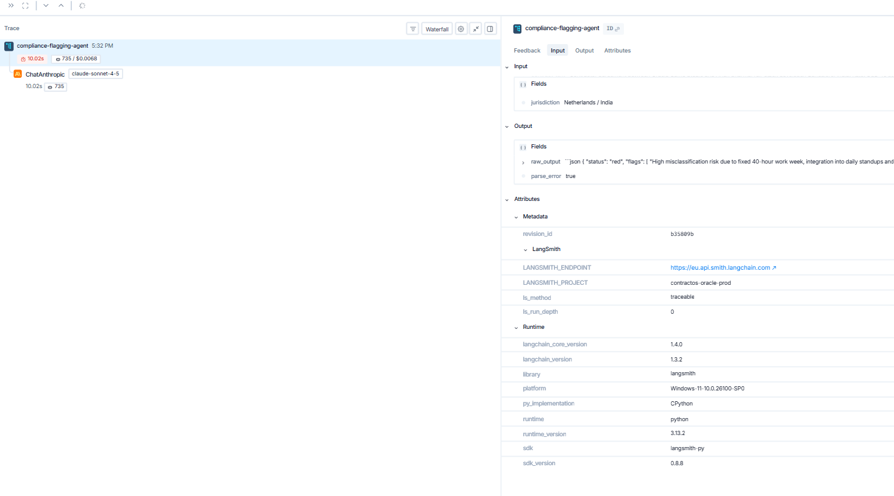
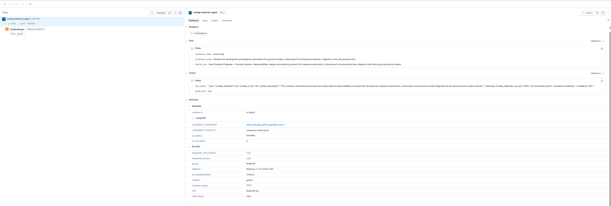
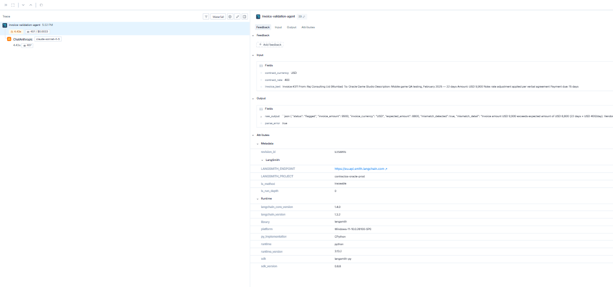
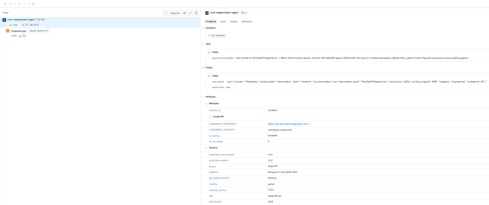

# SilverTrust — Project 4
## AI Consulting Engagement: Oracle Game Studio

**Team:** Daria Bystrova & Julian Granados
**Industry:** Financial Services (Payroll & Contract Intelligence)
**Client:** Oracle Game Studio (Tech industry — assigned by paired team)
**Date:** Week 7

---

## The Engagement in One Sentence

Oracle is a funded indie game studio with 800–900 people across five countries, burning cash faster than it earns — we designed ContractOS, an AI-powered contract and payroll intelligence layer that reads every contract, detects duplicate payments, validates invoices, and gives leadership a live view of where their money is going.

---

## Repository Structure

### Day 1 — Scenario Design & Discovery

| # | Deliverable | File | Status |
|---|---|---|---|
| 1+2 | Industry + rationale + scenario designed for paired team (PulseWork) | [`01_02_scenario_design.md`](./01_02_scenario_design.md) | ✅ |
| 3 | Discovery findings — interview notes, indirect questions, pain-point table, problem statement, solution concept | [`03_discovery_findings.md`](./03_discovery_findings.md) | ✅ |

### Day 2 — Compliant Design, Monitoring & Peer Approval

| # | Deliverable | File | Status |
|---|---|---|---|
| 4+5+6 | Solution design + compliance package + LangSmith monitoring | [`04_05_06_tuesday_deliverables.md`](./04_05_06_tuesday_deliverables.md) | ✅ |
| 7 | Peer approval record — pitch, review board decision, change requests | [`07_peer_approval_record.md`](./07_peer_approval_record.md) | ✅ |

### Day 3 — Revised Proposal & Final Delivery

| # | Deliverable | File | Status |
|---|---|---|---|
| 8 | Revised solution & final proposal | [`08_revised_proposal.md`](./08_revised_proposal.md) | ✅ |
| 9 | Change log — request → action → why | [`09_change_log.md`](./09_change_log.md) | ✅ |

---

## The Client

**Company:** Oracle Game Studio
**CEO/CTO:** Eugen (co-founder)
**CFO:** Thibaud
**Size:** ~900 people
**Locations:** Russia, India, Pakistan, Bangladesh, Philippines
**Business model:** B2C indie games, one-time purchase via Steam — no subscriptions, no recurring revenue
**Financial status:** Funded, at break even — high burn rate, needs to cut costs to return to profitability

---

## The Problem

> Oracle has no visibility over who is engaged, on what terms, and at what cost across 900 people in five jurisdictions. Contracts are unread, invoices go unchecked, subcontractors have been lost track of, and internal work is being duplicated externally. The only lever available is cost — AI cannot fix the revenue side of a one-time purchase model.

---

## The Solution — ContractOS

An AI-powered contract and payroll intelligence layer with five capabilities delivered by five dedicated AI agents, orchestrated by LangGraph:

| Capability | AI Agent | What it does | Pain point solved |
|---|---|---|---|
| Contract Intelligence | Agent 1 — Contract Intelligence Agent | Reads all contracts across formats and languages, extracts key terms, flags IP risk | Lost contractor visibility, no single contract view |
| Invoice Validation | Agent 2 — Invoice Validation Agent | Validates every invoice against contract terms before payment — flags mismatches | Wrong invoicing, payments not matching contracts |
| Overlap Detection | Agent 3 — Overlap Detection Agent | Compares contractor scope against internal roles using semantic similarity — flags duplicate spend | Paying twice for same work |
| Compliance Flagging | Agent 4 — Compliance Flagging Agent | Red/Amber/Green status per contract across five jurisdictions — misclassification, GDPR, IP | Compliance unknown, misclassification risk |
| Cost Categorisation | Agent 5 — Cost Categorisation Agent | Categorises all spend by country, contract type, team, intermediary — live burn view | No cost visibility, burn exceeding revenue |

> ⚠️ **Critical design constraint:** The AI flags and surfaces — a human approves before any payment is sent or any contractor is reclassified.

### v1.1 Enhancements (post client feedback)

Seven change requests from the review board were addressed in ContractOS v1.1:

| CR | Enhancement | Phase |
|---|---|---|
| CR-01 | EOR coverage — Agent 4 flags countries where Oracle has no legal entity | Phase 1 |
| CR-02 | Social registration automation per country | Phase 2 |
| CR-03 | Contract generation workflow up to human signature | Phase 2 |
| CR-04 | PO matching added to Agent 2 (three-way invoice match) | Phase 1 |
| CR-05 | Local accounting rules added to Agent 2 | Phase 1 |
| CR-06 | Intermediary cost tracking in Agent 2 + Agent 5 | Phase 1 |
| CR-07 | Multilingual QA plan — 3 phases, 7 languages, acceptance criteria | Phase 1 |

See [`08_revised_proposal.md`](./08_revised_proposal.md) and [`09_change_log.md`](./09_change_log.md) for full detail.

---

## Compliance Summary

| Area | Classification | Key obligation |
|---|---|---|
| EU AI Act | Minimal risk (extraction, dashboard) / Limited risk (misclassification flagging) | Human-in-the-loop mandatory before any employment-affecting action |
| GDPR — contracts | Lawful basis: contract performance (Art. 6(1)(b)) + legal obligation (Art. 6(1)(c)) | DPA + SCCs required for LLM provider; EU-based infrastructure only |
| GDPR — LLM processing | Legitimate interest (Art. 6(1)(f)) | LIA documented before go-live — 3 LIAs completed |
| Third countries | India (DPDP Act), Philippines (DPA 2012), Russia (sanctions + data localisation) | Data stays EU-side; local counsel required per jurisdiction |
| German BetrVG | Works council consultation required before go-live | SilverTrust provides technical documentation |
| NL DBA Act (2025) | Contractor misclassification flags | Human + legal review before any reclassification |

---

## LangSmith Monitoring

**Project name:** `contractos-oracle-prod`
🔗 **Live link:** https://eu.smith.langchain.com/o/453c43c0-ddb5-408a-a509-630402964189/projects/p/bff005c1-351b-4293-92ca-623f47b8ba5b
**Agents traced:** `contract-intelligence-agent`, `invoice-validation-agent`, `overlap-detection-agent`, `compliance-flagging-agent`, `cost-categorisation-agent`

**What we monitor:**
- Extraction confidence score per field (alert if < 0.80 on critical fields)
- Human override rate (alert if > 20% in 7-day window)
- Latency per agent call (alert if p95 > 30 seconds)
- Failed extractions (zero tolerance alert)
- Compliance flag distribution (alert if Red > 10% of new contracts)
- PII redaction verification (weekly audit, zero tolerance)

**Client reassurance:**
> *"Every time the AI reads a contract, we log exactly what it extracted and how confident it was. If it flags a risk, a human reviews it before anything happens. You have a complete audit trail at all times."*

### Screenshots

| # | File | Agent | Key finding |
|---|---|---|---|
| 1 | `screenshot_01_overview.png` | All agents | 6 runs, all 5 agents traced, latency and cost visible |
| 2 | `screenshot_02_contract_intelligence.png` | Agent 1 | Jana Novak extracted — GDPR clause absent flagged |
| 3 | `screenshot_03_compliance_red.png` | Agent 4 | Arjun Sharma RED — misclassification risk, NL/India |
| 4 | `screenshot_04_overlap_detection.png` | Agent 3 | Jana vs internal engineer — 95/100, €8,500/month duplicate |
| 5 | `screenshot_05_invoice_mismatch.png` | Agent 2 | Raj Consulting — USD 1,100 overbilled, verbal agreement claimed |
| 6 | `screenshot_06_cost_categorisation.png` | Agent 5 | TechStaff Philippines — EUR 8,200/month via intermediary |

**Screenshot 1 — Project overview**

**Screenshot 2 — Contract Intelligence Agent**

**Screenshot 3 — Compliance Flagging Agent: RED**

**Screenshot 4 — Overlap Detection Agent: 95/100**

**Screenshot 5 — Invoice Validation Agent: mismatch flagged**

**Screenshot 6 — Cost Categorisation Agent**

---

## Submission Checklist

- [x] Monday: industry chosen; scenario designed and sent to teacher; discovery findings captured
- [x] Tuesday: solution design, compliance package, LangSmith monitoring documented
- [x] Tuesday: peer-approval record completed
- [x] Wednesday: revised proposal, change log, final deck delivered
- [x] LangSmith project live — link: https://eu.smith.langchain.com/o/453c43c0-ddb5-408a-a509-630402964189/projects/p/bff005c1-351b-4293-92ca-623f47b8ba5b
- [x] Repository accessible to instructors; all links working
- [x] All team members can explain the whole solution

---

## Quick Navigation

| What you need | Where to find it |
|---|---|
| Who is the client and what is the problem | This README — sections above |
| How we discovered the problem | [`03_discovery_findings.md`](./03_discovery_findings.md) |
| What ContractOS does and how it works | [`04_05_06_tuesday_deliverables.md`](./04_05_06_tuesday_deliverables.md) — Deliverable 4 |
| EU AI Act classification and justification | [`04_05_06_tuesday_deliverables.md`](./04_05_06_tuesday_deliverables.md) — Section 5.1 |
| GDPR data map and lawful basis | [`04_05_06_tuesday_deliverables.md`](./04_05_06_tuesday_deliverables.md) — Section 5.2 |
| Legitimate Interest Assessments (3 LIAs) | [`04_05_06_tuesday_deliverables.md`](./04_05_06_tuesday_deliverables.md) — Section 5.2a |
| Compliance memo (plain English) | [`04_05_06_tuesday_deliverables.md`](./04_05_06_tuesday_deliverables.md) — Section 5.5 |
| LangSmith monitoring setup | [`04_05_06_tuesday_deliverables.md`](./04_05_06_tuesday_deliverables.md) — Deliverable 6 |
| Scenario designed for paired team | [`01_02_scenario_design.md`](./01_02_scenario_design.md) |
| Peer approval record | [`07_peer_approval_record.md`](./07_peer_approval_record.md) |
| Revised proposal (v1.1) | [`08_revised_proposal.md`](./08_revised_proposal.md) |
| Change log | [`09_change_log.md`](./09_change_log.md) |
| LangSmith demo script | [`langsmith/langsmith_contractos_demo.py`](./langsmith/langsmith_contractos_demo.py) |
| Spend visualiser (Agent 5) | [`langsmith/agent5_spend_visualiser.py`](./langsmith/agent5_spend_visualiser.py) |

---

*SilverTrust Project 4 — Daria Bystrova & Julian Granados — Week 7*
